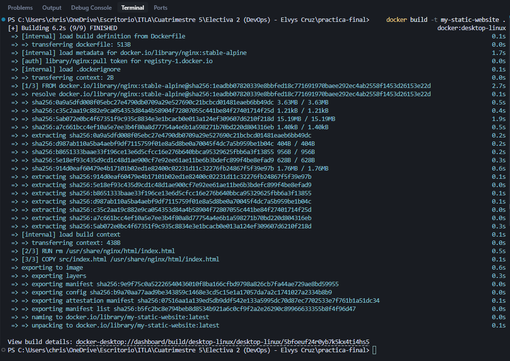
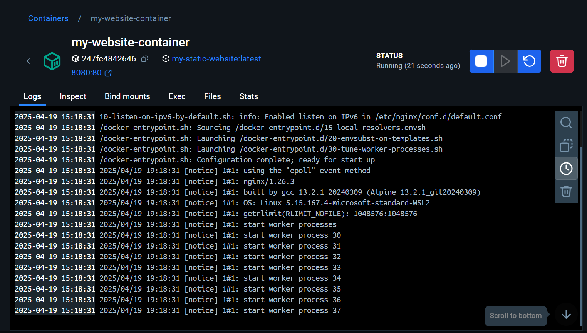
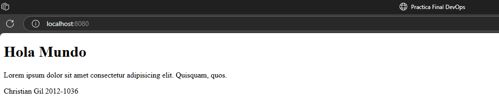
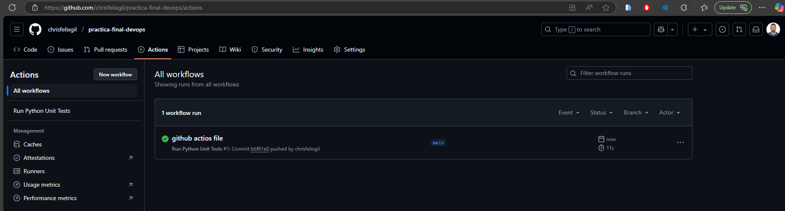

# Practica Final DevOps 🚀

Este proyecto es una aplicación web simple que sirve una página HTML estática utilizando Nginx dentro de un contenedor Docker. Incluye pruebas unitarias para verificar la estructura básica del HTML y un flujo de trabajo de GitHub Actions para la integración continua.

## 👤 Autor
- **Nombre:** Christian Gil
- **Matrícula:** 2012-1036

## 📁 Estructura del Proyecto

```
.
├── .git/                 # Directorio de Git
├── .github/              # Configuración de GitHub Actions
│   └── workflows/
│       └── python-test.yml # Flujo de trabajo para pruebas unitarias
├── .gitignore            # Archivos ignorados por Git
├── Dockerfile            # Define la imagen Docker para Nginx
├── img/                  # Contiene imágenes para el README
│   ├── img1-dockerbuild.png
│   ├── img2-docker.png
│   ├── img3-webUp.png
│   └── img4-github-actions.png
├── LICENSE               # Licencia del proyecto
├── README.md             # Este archivo
├── requirements.txt      # Dependencias de Python para las pruebas
├── src/                  # Código fuente de la página web
│   └── index.html        # Página HTML estática
└── test/                 # Pruebas unitarias
    └── test_index.py     # Prueba para index.html
```

## ✅ Requisitos Previos

*   Python 3.x
*   pip (Administrador de paquetes de Python)
*   Docker
*   Git

## ⚙️ Configuración y Ejecución

1.  **Clonar el repositorio:**
    ```bash
    git clone https://github.com/chrisfelixgil/practica-final-devops
    cd practica-final
    ```

2.  **Instalar dependencias de Python (para pruebas):**
    ```bash
    pip install -r requirements.txt
    ```

## 🧪 Pruebas Unitarias

Las pruebas unitarias verifican la estructura básica del archivo `src/index.html`.

Para ejecutar las pruebas:

```bash
python -m unittest discover test
```

## 🐳 Uso de Docker

El `Dockerfile` configura un contenedor Nginx para servir la página `index.html`.

1.  **Construir la imagen Docker:**
    ```bash
    docker build -t pagina-estatica .
    ```
    

2.  **Verificar la imagen creada:**
    ```bash
    docker images
    ```
    

3.  **Ejecutar el contenedor Docker:**
    ```bash
    docker run -d -p 8080:80 --name mi-pagina-web pagina-estatica
    ```
    *   `-d`: Ejecuta el contenedor en segundo plano.
    *   `-p 8080:80`: Mapea el puerto 8080 del host al puerto 80 del contenedor.
    *   `--name mi-pagina-web`: Asigna un nombre al contenedor.

4.  **Acceder a la página:**
    Abre tu navegador web y ve a `http://localhost:8080`.
    

5.  **Detener y eliminar el contenedor (opcional):**
    ```bash
    docker stop mi-pagina-web
    docker rm mi-pagina-web
    ```

## 🔄 Integración Continua (GitHub Actions)

Este repositorio utiliza GitHub Actions para ejecutar automáticamente las pruebas unitarias cada vez que se realiza un push a la rama `main` o se crea un Pull Request hacia `main`.

Puedes ver el estado de las ejecuciones en la pestaña "Actions" de tu repositorio en GitHub.



## 🙏 Créditos
Este proyecto fue desarrollado como parte de la materia de Electiva 2 (DevOps) impartida por el profesor **Elvys Cruz**.

## 📄 Licencia

Este proyecto está bajo la Licencia MIT - consulta el archivo [LICENSE](LICENSE) para más detalles.


